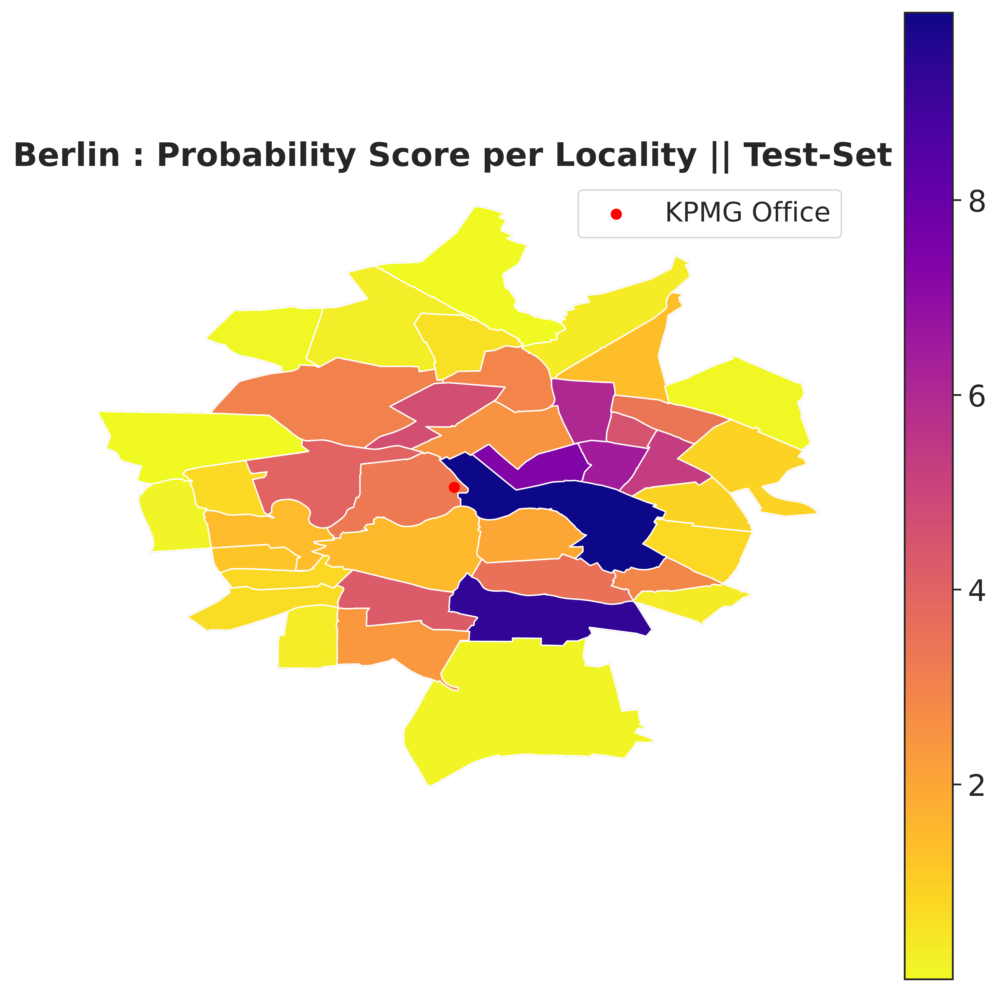

<p align="center">
  </center>
</p>

**Authors:** Stanislas Furrer 

**Date :** 24.11.2021

**Requirements** : (Need to run the notebook package before doing step 3)
```
(base) conda creat --name KPMG python=3.8
(KPMG) pip install requirements.txt
(KPMG) pip install descartes
```
---
# Description of the data

**Context:**

><i> Since 2008, guests and hosts have used Airbnb to expand on traveling possibilities and present more unique, personalized way of experiencing the world. This dataset describes the listing activity and metrics in Berlin from 2015 to 2019.</i>

**Content:**

><i> This data file includes all needed information to find out more about hosts, geographical availability, necessary metrics to make predictions and draw conclusions.</i>

**Acknowledgements:**

><i> This public dataset is part of Airbnb, and the original source can be found on the following Websites :</i>
>* AirBnB-Berlin Data : [Data 2015-2018](http://tomslee.net/category/airbnb-data)<br>
>* AirBnB-neighbourhoods geojson data : [neighbourhoods.geojson](http://insideairbnb.com/get-the-data.html)<br>
>* AirBnB-subway_entrance geojson data : Go on website [overpass-turbo.eu](http://overpass-turbo.eu/) and type : 
>```
>/*
>This is the Overpass query to get the Subway Entrance of Berlin.
>*/
>node
>  [railway=subway_entrance]
> ({{bbox}});
> out;
> ```
 ---
# Project Description

**Story :** 
> It’s March 2017. Rob, a (fictional?) KPMG employee living in Berlin, is very fond of his privacy – he lives moving in and out Airbnb’s and never shares his current address. He would like to invite a few D&A colleagues at his place for a dinner evening and decides to share the key features of his current rental: price, room_type, accommodates, bedrooms, bathrooms (see here for more information and to download historical Airbnb data). **The D&A team needs to figure out where Rob is most likely living.** The task is therefore to create a model that, given a set of room features, for a set of coordinates (latitude, longitude), **calculates a score that quantifies how likely it is that Rob is living at the given latitude-longitude.**

**Solution :**
> - **<i>About the Task</i>** :  Given that Rob is sharing the curent features of rental and we have access to the past activity of all users we will use a **Classification Algorithm** to predict is current **locations.**
> - **<i>About the location</i>** :  We don't want to be too intrusive in the life of Rob, therefore we will **scale the location classification** at the 96 borought of Berlin (see [here](https://en.wikipedia.org/wiki/Boroughs_and_neighborhoods_of_Berlin))
> - **<i>About the Score</i>** : We will quantify the likelihood of Rob living in each of the 96 boroughs of Berlin by the predictive output score of our trained classifier. This score is the confidence score of the model on its prediction, and it can be interpreted as a probability score. We will further tailor our solution by assuming Rob wants to live close to KPMG headquarters. Indeed the traffic in Berlin is very dense. He doesn't want to take too much time to go to work. Therefore we proposed a finetune solution with the constraint that the Airbnb rental has to be at most 5kilometers far from KPMG headquarter. (Only : Heidestraße 58, 10557 Berlin, Germany)
> - **<i>About the model</i>** We will favorite tree-based classifiers as they handle unbalanced datasets and outliers. Specifically, we will look at both standard and ensembling approaches. Indeed, ensembling is the strength to reduce the variance of the decision and generally leads to better performance. 

**Data-Informed Decision Making :**

 > In this project, we will perform a <b>descriptive</b> and <b>exploratory</b> analysis of the data, in order to understand how the phenomena of each variable behave individually and transversely, in addition to generate <b>hypotheses</b> useful for the <b>decision-making </b> part. We will treat the missing inputs through imputation and control the variable properties. <b>In the predictive analytics</b> part, we will present our solution to the tase. Specifically, We will present a set of classifier candidates and study their performance based on the <b>NDCG score</b> and other standard performance metrics. We will look at the importance of the features in decision-making and relate the f1-score to each Berlin area, emphasizing the number of reservations per area. Finally, we will present a <b>prescriptive analysis</b> where we will make further assumptions based on the Data to tailor our solution to the case of Rob. 
 
> The whole analysis will follow a simple and direct structure, well detailed in all topics, aiming at the same time, to create an intuitive and simple <b> guide </b> of which steps must be followed to carry out a good analysis, to in order to understand the data involved in any study. The data consistency is paramout. We  connected it to synergetic complex models and we interpret the result. 

 **Results:**
 
<p align="center">
  </center>
</p>

 >**Model Performance Evaluation :** All Berlin **(Standard Solution)**
<!---
| Top 3 Models             | NDCG_score_test           | Accuracy_score_test  |
| -------------          |:-------------:| -----: |
| **Random Forest**      | 0.871         | 0.789  |
| **Decision Tree**      | 0.803         | 0.801  |
| **XGboosting**         | 0.766         | 0.596  |
-->

<p align="center">
  </center>
</p>
<!---
| Top 5 Areas                    | Predictive Score          
| -------------                 |:-------------:|
| **Tempelhofer Vorstadt**      | 6.299         | 
| **Frankfurter Allee Süd FK**  | 5.781         |
| **Alexanderplatz**            | 4.965         | 
| **Reuterstraße**              | 4.210         | 
| **Rixdorf**                   | 3.994         | 
-->
 
 
  >**Model Performance Evaluation :** Berlin 5 kilometer around KPMG **(Fine-Tuned Solution)**
<!---
| Top 3 Models                  | NDCG_score_test           | Accuracy_score_test  |
| -------------          |:-------------:| -----:|
| **Random Forest**      | 0.886      | 0.8099 |
| **Decision Tree**      | 0.808      | 0.6532 |
| **XGboosting**         | 0.804      | 0.7997|
-->

<p align="center">
  </center>
</p>

<p align="center">
  </center>
</p> 
<!---
| Top 5 Areas                   | Predictive Score          
| -------------                 |:-------------:|
| **Alexanderplatz**            | 9.923         | 
| **Tempelhofer Vorstadt**      | 9.257         |
| **Brunnenstr. Süd**           | 7.353         | 
| **Prenzlauer Berg Südwest**   | 6.456         | 
| **Prenzlauer Berg Nordwest**  | 6.025         | 
-->

---
# Outline

**1. Descriptive Analytics**<br>
A. [Variable types](#type)<br>
B. [Missing Values Analysis and Treatment](#missing)<br>
C. [Frequency Distribution](#freq)<br>
D. [Normality and Outliers Analysis](#Outlier)<br>
E. [Bivariate Analysis](#bivariate)<br>
F. [Multivariate Analysis](#multivariate)<br>
G. [Geographic Analysis](#geo)<br>

**3. Predictive Analytics**<br>
A. [Preprocessing](#Preprocessing)<br>
B. [Modeling](#Modeling)<br>

**4. Prescriptive Analytics**<br>
A. [Result Analysis](#result)<br>
B. [Fine-Tuning](#fine)<br>
C. [Conclusion and Future work](#Conclusion)<br>

---
# 1. Descriptive Analytics

><i> Generally, <b>descriptive analyzes</b> are the first manipulations performed in a <b>quantitative</b> study and their main objective is to summarize and explore the behavior of the data involved in the study. Using statistical techniques such as <b>frequency distribution</b>, <b>measures of central tendency</b> and <b>measures of dispersion</b> we can better understand the way in which the phenomena under study behave.</i>

<h2 id="type">A. Variable Type</h2>

><i> In a <b>quantitative</b> study, it is very important to know what types of data are being studied, because for different types of data different analyzes are performed. The data is divided into two main types: <b>quantitative</b> and <b>qualitative</b>. We can describe them as follows:</i>

**Variáveis Qualitativas**

><i> Qualitative (or categorical) variables are characteristics that cannot be measured numerically, for example: Sex, Gender, Color and education. And they can be <b>nominal</b> or <b>ordinal</b>.</i>

**Variáveis Quantitativas**

><i> The variables classified as quantitative are the characteristics that can be measured on a quantitative scale, that is, they present numerical values that make sense, for example: <b>Height</b>, <b> Mass</b>, <b>Income</b> and <b>Age</b>.</i>

---
<p align="center">
  
</p>

**Ratio Testing and Training :** 9% and 91%

* About Training Dataset
    > - <i>Number of Recorded Activity : **192164**</i>
    > - <i>Number of Column "Features" : **20**</i>
* About Testing Dataset
    > - <i>Number of Recorded Activity : **18999**</i>
    > - <i>Number of Column "Features" : **20**</i>    
**Categorical / Qualitative**
- **Nominal**(variables that have two or more categories, but which do not have an intrinsic order.)
   > - **room_type**
            Entire home/apt 
            Private room
            Shared room
   > - **neighborhood** (Berlin is Devided Into 12 different **neighborhood**)
             Mitte
             Friedrichshain-Kreuzberg
             Pankow
             Charlottenburg-Wilmersdorf
             Neukölln
             Marzahn-Hellersdorf
             Tempelhof-Schöneberg
             Lichtenberg
             Treptow-Köpenick
             Steglitz-Zehlendorf
             Spandau
             Reinickendorf
        
- **Ordinal**(variables that have two or more categories just like nominal variables. Only the categories can also be ordered or ranked.)
   > - **None**
***
**Numeric / Quantitative**
- **Discrete** [int]
  >  - **room_id :** A unique number identifying an Airbnb listing.
  >  - **host_id :** A unique number identifying an Airbnb host.
  >  - **overall_satisfaction:** The average rating (out of five) that the listing has received from those visitors who left a review.
  >  - **accommodates :** The number of guests a listing can accommodate. 
  >  - **bedrooms :** The number of bedrooms a listing offers. 
  >  - **minstay :** The minimum stay for a visit, as posted by the host. (Numbers of Nights)
  >  - **reviews :** The number of reviews that a listing has received
  

- **Continous** [float]
    >  - **longitude** 
    >  - **Latitude**
    >  - **Price :** The price (in US-Dollar) for a night stay. 

**Other :**
- **Date**
    > - **last_modified :** the date and time that the values were read from the Airbnb web site.

***

**Note: Some Columns have only NaNs Values.** 

**Categorical / Qualitative**
- **Nominal**
    >  - **location :** It is the country. It will be always Germany. **DISCARED**
    >  - **name :**  It is the name of the Owner of the Account. **DISCARED**
    >  - **city :** It is the name of the City. It will be always Berlin. **DISCARED**
    >  - **country :**  It is the country. It will be always Germany.  **DISCARED**

**Numeric / Quantitative**
- **Discrete**
    >  - **borough :** For some cities, there is no borough information. See <a href="http://tomslee.net/airbnb-data-collection-get-the-data">Here</a>.</i> **DISCARED**
    >  - **survey_id :** Survey Id. Will be useless in the prediction. **DISCARED**
    >  - **bathrooms :** It is the number of the bathrooms. The information is Missing. **DISCARED**

<h2 id="missing">B. Missing Values Analysis and Treatment</h2>

- **Note :** 
    > In the previous Part we have exclude the column that contain only "Not a Number Value" as they are not   relevant for our predictive tasks. It correspond to the **Deletions** branch in the Graph below

    > Some row have 0 bedrooms. It is most probably wrong, **therefore we will pridict the real number of room based on predictors.**
### Missing Values in training set 
- **Categorical Data**
    > - [room_type](#missing1) (<font color = "red"><b>0.005%</b></font>). Imputation based on predictors 

- **Numerical Data**
    > - [Minstay](#missing2) (<font color = "red"><b>40.022%</b></font>). Deletion 
    > - [Overall_satisfaction](#missing3) (<font color = "red"><b>21.678%</b></font>). Imputation based on predictors
    > - [Accommodates](#missing4) (<font color = "red"><b>4.952%</b></font>). Imputation based on predictors
    > - [Bedrooms](#missing5) (<font color = "red"><b>3.546%</b></font>). Imputation based on predictors
    > - [host_id](#missing6) (<font color = "red"><b>0.005%</b></font>). Imputation based on predictors
    
### Missing Values in testing set :
- **Numerical Data**
    > - [Minstay](#missing2) (<font color = "red"><b>100.000%</b></font>). Deletion 

<p align="center">
  
</p>

<p align="center">
  
</p>

<p align="center">
  
</p>

**Obervation** : 
> * The imputation based on predictors match the original distributions
> * We remove the Minstay night features as it is missing in the all testing dataset. We could have use the [insideairbnb](http://insideairbnb.com/) dataset to found matching paterns. 
> * We fix the case where the number of bed is egal to zero as it might be an error. We use predictors to get accurate results.


<h2 id="missing">C. Frequency Distribution</h2>

<p align="center">
  
</p>


<p align="center">
  
</p>

**Obervation** : 
> * The over all satisfaction is either very good (4.5-5) or very bad
> * The majority of the room Type are either Private room or Entire home/apt.
> * Some Area of berlin are highly populated in terme of listening
> * The number of Bedrooms is mostly between 1 and 3 and the number of accommodates between 1 and 4
> * Latitude and Longitude present the characteristics of Berlin
> * The price and review distribution seems to follow logarithmic curves. We will futher analysis their characteristics in the next sections.

<h2 id="Outlier">D. Normality and Outliers Analysis</h2>

**Important Note :** 
>In the predictive part we will show that tree based model have the best performance. Tree based model have the nice properties to handle outliers and un-balanced classes. We have compared the performance of our model when removing outlier, when using the log-scale of the price and when doing nothing. The result have shown that tree-based model performance are the best when not proceeding log-scale and outliers removal. The explaination can be found in the predictive analytics part. 

However, we will still compute the price-log scale in order to make statistical test.

* <b>Normality</b> - Data should look like a normal distribution. This is important because several statistic tests rely  on this (e.g. t-statistics). Univariate normality doesn't ensure multivariate normality (which is what we would like to have), but it helps.

**Skewdness**
* Degree of distortion from the symmetrical bell curve or the normal curve. 
* A symmetrical distribution will have a skewness of "0". 
* There are two types of Skewness: <b>Positive and Negative.</b> 
    * <b>Positive Skewness</b> means the tail on the right side of the distribution is longer and fatter. The mean and median will be greater than the mode similar to this dataset. 
    * <b>Negative Skewness</b> means the tail on the left side of the distribution is longer and fatter. The mean and median will be less than the mode. 
* Skewness differentiates in extreme values in one versus the other tail. 


<p align="center">
  
</p>


<b>Kurtosis</b>
According to Wikipedia, 

*In probability theory and statistics, **Kurtosis** is the measure of the "tailedness" of the probability. distribution of a real-valued random variable.* So, In other words, **it is the measure of the extreme values(outliers) present in the distribution.** 

* There are three types of Kurtosis: <b>Mesokurtic, Leptokurtic, and Platykurtic</b>. 
* **Mesokurtic** is similar to the normal curve with the standard value of 3. This means that the extreme values of this distribution are similar to that of a normal distribution. 
* **Leptokurtic** Example of leptokurtic distributions are the T-distributions with small degrees of freedom.
* **Platykurtic** describes a particular statistical distribution with thinner tails than a normal distribution. Because this distribution has thin tails, it has fewer outliers (e.g., extreme values three or more standard deviations from the mean) than do mesokurtic and leptokurtic distributions. 


<p align="center">
  
</p>

You can read more about this from [this](https://codeburst.io/2-important-statistics-terms-you-need-to-know-in-data-science-skewness-and-kurtosis-388fef94eeaa) article. 

---

We have one Numerical continuous variable right skewed with high Kurtosis : <font color = "red"><b>Price</b></font>

We have one Numerical discret variable right skewed with high Kurtosis : <font color = "red"><b>Reviews</b></font>

In order to by pass the **right skewed** of price we will take the logarithm of the prices.
However, Reviews won't become normal after making it logarithm.


We will use the Inter Quartile Range(IQR) to detect the outliers. IQR tells us the variation in the data set. Any value, which is beyond the range of -1.5 x IQR to 1.5 x IQR treated as outliers. <font color = "red"><b>Outliers are removed from the dataset</b></font>


* Q1 represents the 1st quartile/25th percentile of the data.
* Q2 represents the 2nd quartile/median/50th percentile of the data.
* Q3 represents the 3rd quartile/75th percentile of the data. 
* (Q1–1.5*IQR) represent the smallest value in the data set and (Q3+1.5*IQR)
    represnt the largest value in the data set.
    
- **Price :** Remove Outlier with IQR
> - Outliers :  <font color = "red"><b>1.6%</b></font>
> - Clean_price : <font color = "green"><b>98.4% </b></font>with price in [9, 150] Us Dollars

- **Review :** Remove Outlier with IQR
> - Outliers :  <font color = "red"><b>12.1%</b></font>
> - Clean_price : <font color = "green"><b>87.9% </b></font>with reviews in [0, 26]

<p align="center">
  
</p>

**Obervation** : 
> * As expected when taking the log scale of the price we obtain a distribution that is almost normal.
> * Removing the outliers with IQR reveals the most relevant price distributions.
> * We will keep the outliers in the rest of the project as they are most probably linked to the situation where we have a ot of bedrooms or accomodation.

<h2 id="bivariate">E. Bivariate Analysis</h2>

Being the most important part, bivariate analysis tries to find the relationship between two variables. We will look for correlation or association between our predictor and target variables. Bivariate analysis is performed for any combination of categorical and numerical variables. The combination can be: Numerical & Numerical, Numerical & Categorical and Categorical & Categorical. Different methods are used to tackle these combinations during analysis process. The methods are:

1. Numerical & Numerical: Pearson's correlation, or Spearman correlation (the later doesn't require normal distribution).
2. Numerical & Categorical: Point biserial correlation (only if categorical variable is binary type), or ANOVA test. For this problem, we will use biserial correlation
3. Categorical & Categorical: We would use Chi-square test for bivariate analysis between categorical variables.

- **Note** : 
 > - Sometime the anaylsis need to be done with unique Room in order to not be biased in the Analsis

### Theoretical Reminder

**Pearson's r :** **Numerical-Numerical** and **Categorical-Numerical**

The correlation matrix is identical to a covariance matrix computed from standardized data. The correlation matrix is a square matrix that contains the Pearson product-moment correlation coefficients (often abbreviated as [Pearson's r](https://en.wikipedia.org/wiki/Pearson_correlation_coefficient)), which measure the linear dependence between pairs of features:

Pearson's correlation coefficient can simply be calculated as the covariance between two features x and y (numerator) divided by the product of their standard deviations (denominator):

The covariance between standardized features is in fact equal to their linear correlation coefficient.
Use NumPy's corrcoef and seaborn's heatmap functions to plot the correlation matrix array as a heat map.

**Chi-squared tests :** **Categorical-Categorical**

Chi-squared tests are based on the so-called chi-squared statistic. You calculate the chi-squared statistic with the following formula:

$$ sum(\frac{(observed-expected)^2}{expected}) $$

The Chi-square test of independence tests if there is a significant relationship between two categorical variables.The data is usually displayed in a cross-tabulation format with each row representing a category for one variable and each column representing a category for another variable.

**The H0 (Null Hypothesis): There is no relationship between variable 1 and variable 2.**

**The H1 (Alternative Hypothesis): There is a relationship between variable 1 and variable 2.**

If the p-value is significant (less than 0.05), you can reject the null hypothesis and claim that the findings support the alternate hypothesis. While we check the results of the chi2 test, we need also to check that the expected cell frequencies are greater than or equal to 5. If a cell has an expected frequency less that 5, then the Fisher’s Exact test should be use to overcome this problem.

<p align="center">
  
</p>

**Obervation** : 
The most interesting information : 
> - **PLEASE NOTE:** All the probabilistic result are in the notebook. I need to verify my implementation of the p-values. Sorry I might have done a typo
> - The type of room is correlated to the price. Indeed, home and flat are more expensive than a shared room.
> - The price increase when the number of bedrooms/accommodates increase. The variance increase also as we have fewer samples. It is the effect of the outliers.
> - There is no significant correlation between the price and the date. It is a prevered result since we are doing classification and not forecasting.
> - The hypothesis that the year or the month might influence the choise of room type is **Rejected** by the Chi-Square test 
> - The hypothesis that the year or the month might influence the number of bedrooms  is **Rejected** by the Chi-Square test 
> - The hypothesis that the year or the month might influence the choice of neighbourhood is **Rejected** by the Chi-Square test 

<h2 id="multivariate">F. Multivariate Analysis</h2>

<p align="center">
  
</p>

**Obervation** : 
The most interesting information : 
> * The number of bedrooms and accommodates are correlated with the price. Indeed, if we have more room we expect to have a higher price.
> * The month and years have no correlation with the price, the overall satisfaction, the bedrooms and the review. We could have use a forecasting approach to solve the problem. However, since there is no linear relation between the parameters and the date classification is a better approach. 


<h2 id="geo">G. Geographic Analysis</h2>


<p align="center">
  
</p>

**Obervation** : 
The most interesting information : 
> * The AirBnB rantal have a higher density in the center of Berlin and Around the KPMG headquarter
> * We will select the distance to KPMG as a features for or recommender system. Idealy we would have set the center of interest in the most visited place of Berlin or it's center. We select KPMG just as a toy exemple. However, it is located in an area with a lot of Airbnb Rental. Although it is not the ideal decision, it is more entertaining. 
> * The price is slightly higher in the center of berlin. However, there is no statistically significance correlation between the price per night and the distance to KPMG.
> * We have add the subway entrance on the map. In a future work it would be a great features to strengh our recommender. For more discussion about it, please refer to the conclusion. 

---
# 2. Predictive Analytics
In this section we will present our model candidate for the recommender tasks. Specifically : 

> - We present a set of model candidat, the performance metrics and some preprocessing made. We will use as baseline model Logistic Regression and Naive Bayes. We will compare their performance with tree based algorithm as they have the nice properties to handle unbalanced dataset and outliers. We will look at a standard decision tree classifier as well as ensembling of tree with RandomForest and XGboosting. Ensembling have several advantage over regular model as they reduce the variance of the decision by some type of hierachical voting.  
> - We will then analyse the features importance in the decision making. As we might expect, the price, the number of reviews and the distances to KPMG are the most important features in the decision process. In fact, for humans, this parameters would also be our key variable for making our decision of renting an AirBnB accomodations.
> - Finally, we will inspect the evaluation metric and relate them to each area of Berlin. 

<h2 id="Preprocessing-id">A. Preprocessing</h3>

**Part1. Remove Features**
> - Some Features are not relevant for the predictive task and might even hurt or biased the model as it will increased significantly the number of parameters.

> - We will keep as features : [room_type, reviews, overall_satisfaction, accommodates, bedrooms, price, year, month, distToKPMG] and predict the [neighbourhood]. We would have keep the host_id if we would have more information about the host as it might influence the decision.

> - **IMPORTANT Note**: I tried bining bedrooms and accomodates into 6 class [1,2,3,4,5,>5]. It increase the performance of the baseline model while deacrease the performance of the tree based model. The tree based algorithm are robust to outlier where the baseline aren't. Therefore for the tree based classifier binning will remove some important information while for the baseline classifier it will reduce the impact of the outliers. Therefore **WE WON'T USE BINNING** 

**Part2. Encoding**
> - We will convert "room_type" into Categorical Data. 
> - We will make use of the function get_dummies from pandas. The dummy coding scheme is similar to the one hot encoding scheme, except in the case of dummy coding scheme, when applied on a categorical feature with m distinct labels, we get m-1 binary features. Thus each value of the categorical variable gets converted into a vector of size m-1. The extra feature is completely disregarded and thus if the category values range from {0, 1, ..., m-1} the 0th or the m-1th feature is usually represented by a vector of all zeros (0).
> - **IMPORTANT Note**:We tried to convert also "overall_satisfaction","accommodates","bedrooms","year","month" into Categorical Data and apply one hot-encoding but it hurts the performance off the tree based models. **WE WON'T USE ONE HOT ENCODING FOR THE MENTIONED VARIABLE**

To understand this, let’s get into the inner dynamics of tree-bases models. For every tree-based algorithm, there is a sub-algorithm that is used to split the dataset into two bins based on a feature and a value. The splitting algorithm considers all possible splits (based on all features and all possibles values for each feature) and finds the most optimum split based on a criterion. We will not get into details of the criterion (there are multiple ways to do this) but qualitatively speaking, the criterion helps the sub-algorithm select the split that minimizes the impurity of bins. Purity is a proxy for the number of positive or negative samples in a particular bin in a classification problem.

<p align="center">
  </center>
</p>

If a continuous variable is chosen for a split, then there would be a number of choices of values on which a tree can split and in most cases, the tree can grow in both directions. The resulting tree from a dataset containing a majority of continuous variables that would look like something in the figure to the left.

Categorical variables are naturally disadvantaged in this case and have only a few options for splitting which results in very sparse decision trees. The situation gets worse in variables that have a small number of levels and one-hot encoding falls in this category with just two levels. The trees generally tend to grow in one direction because at every split of a categorical variable there are only two values (0 or 1). The tree grows in the direction of zeroes in the dummy variables.


**Part3. Scalling**

> - We tried scalling both price and distance to KPMG with sklearn's StandardScaler() however **it hurt the performance** of three based algorithm while improving the performance of logistic regression and KNN. 
> - It is expected for logistic regression, KNN and Naive Bayes algorithm
> - Decision trees and ensemble methods do not require feature scaling to be performed as they are not sensitive to the the variance in the data. Indeed, tree based algorithm are rule based and do not compute distances. **WE WON'T USE SCALLING**


**Part4. Stratisfied klfold Cross-Validation**

>**Kfold Cross Validation**: divide the data into folds and ensure that each fold is used as a testing set at some point. It is a regularization technique that reduce the variance of the decision and the overfitting.

<p align="center">

</p> 

>**StatifiedKfold** : Stratification is the process of rearranging the data as to ensure each fold is a good representative of the whole. For example in a binary classification problem where each class comprises 50% of the data, it is best to arrange the data such that in every fold, each class comprises around half the instances. It ensure to keep the same class distribution in each fold. In our case, we have a strong un-balanced situation, therefore this methods is essential.

**Part5. Performance Metric**

To evaluate the model performance we will use the NDCG score, f1 score and the accuracy. 

**NDCG**
>- NDCG stands for ***Normalized Discounted Cumulative Gain.***

>- To evaluate recommender systems we need to measure how relevant the results are and how good the ordering is.

>- To understand NDCG, we need to understand its predecessors: Cumulative Gain(CG) and Discounted Cumulative Gain(DCG). Also, we need to keep the following assumption in mind: *The highly relevant documents are more useful than moderately relevant documents, which are in turn more useful than irrelevant documents.*
>- The gain is  the relevance score for each item recommended. The cumulative gain at K is the sum of gains of the first K items recommended. Discounted cumulative gain weighs each relevance score based on its position. The recommendations at the top get a higher weight while the relevance of those at the bottom get a lower weight. 
<p align="center">
  </center>
</p>

> - The normalized discounted cumulative gain is the DCG with a normalization factor in the denominator. The denominator is the ideal DCG score when we recommend the most relevant items first. 
<p align="center">
  </center>
</p>

**F1-score** : 
> - The F1 score is defined as the harmonic mean of precision and recall.
> - As a short reminder, the harmonic mean is an alternative metric for the more common arithmetic mean. It is often useful when computing an average rate.
> - In the F1 score, we compute the average of precision and recall. They are both rates, which makes it a logical choice to use the harmonic mean. 
> - The F1-score is an excellent metric for un-balanced classes. It makes it well suits for our task. 
> The F1 score formula is shown here:

<p align="center">
  </center>
</p>

**Accuracy** :
> - It is the most standard metric for evaluating the model performance. 
> - However, it is not well suited in our context as we have unbalanced classes.
> - We will use it as an informative metric rather than a metric to optimize. 

<p align="center">
  </center>
</p>

<h2 id="Modeling">B. Modeling</h3> 

We select tree baseline model and tree tree-based model with an increasing level of complexity. 

**Multinominal Logistic Regression** : 
> * Logistic regression uses functions called the logit functions,that helps derive a relationship between the dependent variable and independent variables by predicting the probabilities or chances of occurrence. It is the go-to technique for classification. **However** it as a lot of assumption and we haven't process our data to match them. (minimal or no multi-collinearity, independent variables that linearly related to log of odds, a large sample in each classes, removing outliers as it introduce autocorrelation...)

**KNN** : 
> * KNN predict the correct class for the test data by calculating the distance between the test data and all the training points. Then select the K number of points which is closet to the test data. The KNN algorithm calculates the probability of the test data belonging to the classes of ‘K’ training data and class holds the highest probability will be selected. In the case of regression, the value is the mean of the ‘K’ selected training points. **However** it's performance strongly depend on the choise of K, and KNN is weak against outliers.

**Naives Bayes** : 
> * Naives Bayes use the Bayes theorem. We wanted to verify if knowing some priors and evidence would be enough to make a good recommender. **However** it assume independence between the features. 

**Decision tree and Boosting** : 
> * Decision tree, Random Forest and XGBoosting are tree based classifier. It is rule based classifier with great interpretability and that handle the outliers and skewed distribution very well. Random Forest and XGBoosting have futher advantage as they are ensembling of tree classifier. Specifically, it is boosting technique that reduce the variance of the decision by acting as a regularizer. Additionally, boosting has the advantage to handle specifically well the outliers by design. In boosting technique each iteration aims at reinforcing the weight of missclassified samples. Due to time constrain we won't enter into more details 

> **PLEASE NOTE**: We have organize our data wrangling and data processing in order to optimize the performance of the tree based algorithm. The choices that have been made are expect to hurt significantly the performance of the baseline models. Indeed, we haven't **remove the outliers** in review and price, we haven't **fix the skewedness of the price throught a logarithm scaling and a box-cox treatment**, we haven't **binned some parameters**, we haven't **one hot encode all the categorical parameters** and we haven't **Standardize any parameters**. **HOWEVER** the code to processed any of the aforedmentioned processing is include in the notebook. 

<p align="center">
  </center>
</p>

<p align="center">
  </center>
</p>

**Obervation** : 
> * As expected the tree based algorithm have better performance than the baselines. Indeed, we have optimize for tree-based algorithm and the baseline have a lot assumptions that we do not met. 
> * Our best model is Random Forest and it's recommender score is very good.
> * The highest likelihood score where Rob might be renting is flat are near KPMG headcarters

> Next we analyse the importance of the features in the decision making of the tree-based classifier. 


<p align="center">
  </center>
</p>

**Obervation** : 
> * For Random Forest and Decision Tree the distance to KPMG is the most impactful parameters in the decision making. Indeed, as discused KPMG is more or less in the center of berlin. It is one of the places where there is the most AirBnB rental. Selecting KPMG as the center of interest is definitly not the best choice (we made it as a toy exemple) however it seems to be a relevant information
> * In fact the distance to KPMG leak the real position of the rental and therefore the model "short-cut" is learning process as it learn to match the relative distance to KPMG to a given neighbours.  
> * However, even if the model would perfectly fit the relation between the distance to KPMG and the area of Berlin it won't be enough as we would have to consider the radious of the distance. This might be the reason why the distance to KPMG is not the only features in the decision making.
> * The three next most important features are the price, the review and the accomodates.
> * As expected the month, year and type of room haven't so much influence as they are similarly distributed in each area. They are not relevant to make a distinction.
> * The biggest difference between the models is that XGBoosting decision is mostly impacted by the number of bedrooms and the features importance is more distributed than RandomForest and Decision Tree.


---
# 3. Prescriptive Analytics

In this section we will try to understand how we might improve our recommender system. 

> - We will examine the misclassification through the lens of the f1-score per area, emphasizing the number of occurrences of each class.
> - We will make the assumption that Rob wishes to live at most 5km far from KPMG headquarter. From this assumption, we will retrain our models to get better performance on this specific task.
> - We observe better performance of our recommender system based on all the metrics.  The main reason for this improvement comes from the better class balance induced by our assumption. Indeed, there is more listening in these areas.
> - Finally, we will delineate our conclusion and present improvements

<h2 id="result">A. Result Analysis</h2>

**F1 score Analysis**

The classes (neighbours) are highly imbalanced. Alghough the tree based algorithm are well suited to handle un-blanced dataset we might reduce this effect. In our previous analysis we show that the farrer a neighbours is from the Center of Berlin the less sample we have. In the following we plot the f1 score iin function of the distance of KPMG and vizualize for each area of Berlin. We use the f1 score as it is a well suited performance metric for unbalanced Dataset. 

<p align="center">
  </center>
</p>

**Obervation** : 
> * The f1 Score has a strong variance when the number of Airbnb Rental is low. However, the more we have data the less variance we have.  
> * The f1 Score have a Mean around 80%. 
> * The neighbours in the center are more representative of the 80% f1-score.

<h2 id="fine">B. Fine-Tuning</h3> 
We will tailord our task by assuming that Rob wish to live at most 5 kilometer far from KPMG headquarter. Hopefully, this assumption makes the classes less unbalanced as we have more rental in the center of Berlin. Algought defining KPMG distance as a features will limit the model performance, it match (under a certain precision) the center of interest of Berlin.  

<p align="center">
  </center>
</p>
<p align="center">
  </center>
</p>

**Obervation** : 
> * Our model have Better performance in term of the NDCG score, Accuracy and F1-score. The main cause is that the class unbalanced has be lowered by our assumption.
> * The f1 score have less variance because we have a dense sampling for each area except for **Weißensee**. According to our webseach **Weißensee** is a calm residensial area where there is not so many AirBnB.

<h2 id="Conclusion">C. Conclusion and Future work</h3> 

In this project, we have presented a data-driven approach to predict the future location of Airbnb bookings in Berlin. Specifically, we offer a probabilistic approach to quantify the area of Berlin where the users in 2017 will most probably make a reservation.

In order to solve this task, we had to proceed into data cleaning through missing input imputation and a wide range of data analyses. We then select a set of model candidates for the classification task. We analyze the performance of each model based on the NDCG score and other performance metrics (accuracy,f1-score, recall, precision). We analyze the importance of the features and present a probabilistic score for each area of Berlin. We try to understand the misclassification through the lens of the f1-score per area, emphasizing the number of occurrences of each class. Finally, we proposed a fine-grained approach that focused on a user working at KPMG Berlin who wants not to be farther than 5 kilometers from Berlin.

Our best recommender system on the fine-grained contraint (less than 5km from KPMG) obtain a **NDCG_score** = 0.887 and an **accuracy** = 80%  on the test set. The test set is all the Aibnb reservations made in 2017.

**Improvement and Future Work**

In all data Science projects, it is paramount to understand and work around the tradeoff between "the level of detail and the time requirement." Indeed, the priority is to match the company or consumer deadline with the highest output quality possible. However, it is always possible to improve the data quality, the model performance or make better visualization. This project had to be implemented in less than five days. We prioritize the overall structure with a strong emphasis on justifying our choices. 

The recommender system we built is biased by our assumption that every user is interested in being as close as possible to KPMG. This hypothesis has been made to match our scoring target per area where Rob working at KPMG might book his next flat. 

In the following, we propose a list of potential improvements. We believe the performance might be significantly improved if we include more parameters. The following might be considered as Data-centric improvement of the pipeline : 

**Data Centric :**
> * Use more data in order to have more dense sampling for each area. Add data from [insideairbnb](http://insideairbnb.com/)
> * The distances to bus or railway station might be significant in the user's choise. [Here](https://medium.com/@brendan_ward/how-to-leverage-geopandas-for-faster-snapping-of-points-to-lines-6113c94e59aa) is an implementation for computin the shortest distance to subway given a data point.
> * The Access to restaurants, shops, cafes, bars and pubs are important for Airbnb users.
> * We removed the Host Id info : However if we would have past info about the host then it would propably influence the result
> * Having access to the review comment might be usefull. We could compute a sentiment score with a BERT model finetuned for emotion classification.  
> * We could also include image quality as a feature. Shunyuan et al. 2017 [here](https://papers.ssrn.com/sol3/papers.cfm?abstract_id=2976021), have shown that Airbnb property demand changed after the acquisition of verified images (taken by Airbnb’s photographers). 


**Data Centric :**
> * Use tree pruning and Features selection to reduce the Overfitting
> * Conduct a grid search for hyper parmeter selection. **PLEASE NOTE** We have implemented the code for the grid search, however due to time constrain we haven't run it.
> * Try Deep Deural Network. Specifically, try a Multi-Layers-Perceptron with as regularization dropout and layer-normalization and as optimizer Adam. (This is my speciality. I have a lot of project where I implemented all sort of Deep Learning Architecture([here](https://github.com/stanFurrer/Multimodal-solution-for-grasp-stability-prediction), [here](https://github.com/stanFurrer/Meta-Learner-LSTM-for-Few-Shot-Learning), [here](https://github.com/stanFurrer/A-Comparison-Between-Two-Manifold-Techniques),[here](https://github.com/stanFurrer/Emotion-Analysis-On-Opensubtitle-), [here](https://github.com/stanFurrer/Robust-Multimodal-Contrastive-Learning)... ). However, I prioritize the interpretability of the project rather than optimizing the performance.)

**Lessons Learned**

1. Great opportunity to work with geographic data and to connect them to the model performance.
2. There is a tone of geographic information about transport and market for every city online and it is very intuitive to collect and work with them.


And that’s all. **This was a very fun project to work with.**

If you somehow managed to go through the whole thing and are reading this, thank you for your time! Any feedback is much appreciated.
